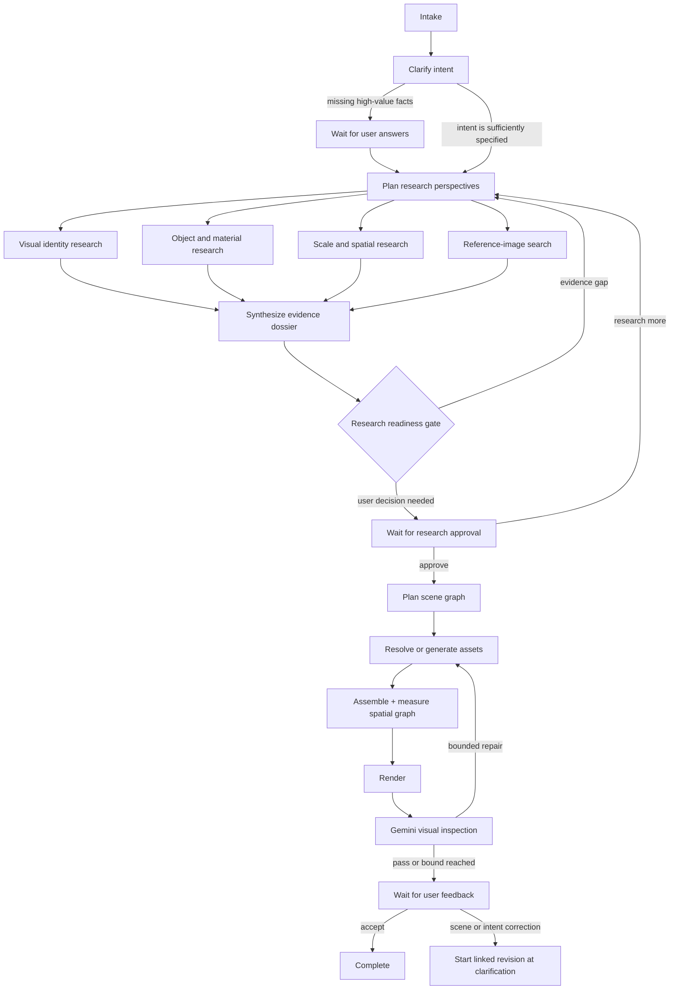

# Agent graph design

This document defines the backend-owned interaction graph for SeeIn. The renderer may display graph state and submit typed user input, but it never chooses a node, calls Gemini, researches, plans, or mutates a scene directly.

## Why this is a graph

The workflow has three properties that a fire-and-forget pipeline cannot represent safely:

1. it must stop for clarification or approval and resume hours later;
2. research branches can run concurrently, then join at an evidence gate;
3. visual and user feedback can route back to a targeted earlier node without restarting unrelated work.

The graph is an explicit, versioned state machine. Gemini operates *inside* semantic nodes. Typed backend guards choose edges. This follows the durable-agent guidance to keep progress in an explicit state schema rather than infer it from chat history, and the graph-orchestration distinction between model work and deterministic control flow.

## State, notes, and provenance

Every project has one immutable sequence of graph checkpoints. A checkpoint contains:

- `node` and `status`: the exact execution cursor (`running`, `waiting`, `completed`, or `failed`);
- `intent`: the current user-approved interpretation, including audience, purpose, desired fidelity, style, must-have objects, interaction needs, and constraints;
- `clarifications`: question/answer turns with the reason each question was worth asking;
- `notes`: small typed facts, never an unbounded transcript;
- `researchAgenda`: perspective-specific questions, queries, and required evidence;
- `researchDossier`: source-bound findings, object studies, image references, contradictions, gaps, and readiness scores;
- final scene revision, bounded inspection result, and feedback routing; detailed scene geometry, relationships, screenshots, and revisions remain in their dedicated artifact and ClickHouse records;
- `preferenceProfile`: explicit, scoped preferences learned from user feedback;
- `steps`: user-facing progress and the next safe action.

Notes use explicit kinds: `user-requirement`, `user-preference`, `decision`, `assumption`, `research-finding`, `uncertainty`, `spatial-fact`, and `feedback`. Each note records its scope (`project` or `user`), source, confidence, and creation time. User-scoped preferences are promoted only from explicit answers or feedback—not silently inferred from clicks.

Project folders remain the artifact source of truth. Checkpoints are written under `graph/checkpoints/` and the latest snapshot under `graph/state.json`. ClickHouse stores the same snapshots plus typed columns for current node, wait reason, graph version, and update time. That gives fast project lists and resume lookup without turning ClickHouse into a blob store.

## Clarification policy

Clarification is not a fixed onboarding form. The clarifier first lists uncertainties over these intent dimensions:

- subject identity and scope;
- purpose and audience;
- physical/historical accuracy versus stylization;
- viewpoint, composition, and environmental context;
- must-have and must-avoid objects;
- interaction or teaching sequence;
- output constraints such as scale, object count, or performance.

It asks only questions whose answers could change research queries, asset selection, scene structure, or evaluation criteria. Questions are ranked by expected information gain; redundant or cosmetic questions are dropped. The MVP uses one turn containing one to four questions. Remaining low-impact uncertainty becomes an explicit assumption note.

This design is informed by recent work on information-gain clarification and proactive information gathering, which finds value in questions that expose missing user knowledge rather than generic restatements.

## Research before generation

Planning a Blender recipe in the same call that first researches the topic is prohibited. Research runs before scene planning and is organized around multiple perspectives, following STORM's perspective-guided question asking:

1. **Visual identity:** silhouette, canonical views, distinctive features, style and period cues.
2. **Objects and materials:** required components, construction, materials, color, topology implications, common confusions.
3. **Scale and space:** real or plausible dimensions, support/contact relationships, relative scale, layout constraints, and useful viewpoints.

The three evidence branches are independent and run concurrently on Gemini 3.7 Flash. A fourth concurrent node uses Gemini 3.1 Flash Image for grounded reference-image discovery. The image node contributes returned image chunks and required Google attribution, not free-form claims or structured model output. Synthesis merges duplicate sources, detects contradictions, and creates one `ObjectStudy` per planned object candidate.

The readiness gate is deterministic. Generation is forbidden until all required checks pass:

- every must-have concept maps to an object study or an explicit environment element;
- every important object has at least one identifying reference or a recorded reason why none is needed;
- each object has silhouette/parts/material notes and approximate scale evidence;
- important relationships have direction and support/contact semantics;
- unresolved contradictions and low-confidence claims are visible;
- the dossier reaches configured source, reference, and coverage thresholds.

The audit may request one bounded follow-up research round. If the remaining gap depends on taste or intent rather than public evidence, the graph asks the user instead of searching indefinitely.

Gemini Google Web Search grounding on 3.7 Flash and Google Image Search grounding on 3.1 Flash Image remain the default discovery path. Firecrawl is an optional targeted extractor only when an approved source is JavaScript-heavy or a user explicitly requests deep traversal; it is not a second default search engine.

## Guided visualization and feedback

The renderer displays a backend-produced guide beside the scene:

- the current graph step and why it matters;
- clarification cards or a research-readiness summary while waiting;
- scene states as a deliberate teaching sequence rather than unlabeled animation buttons;
- evidence/reference links associated with the currently highlighted objects;
- a compact feedback form.

Feedback is structured as `accept`, `revise-scene`, or `revise-intent`. A revision can target objects and choose issue categories such as wrong identity, missing part, scale, layout, lighting, label, teaching order, or style, plus free text. The backend records both the raw feedback and a normalized note. A revision starts a linked project at clarification with the same explicit preference profile; unchanged semantic-node inputs and compatible measured assets remain eligible for reuse.

Adaptation stays inspectable. The project response shows which explicit preferences affected the current run, and new explicit feedback overrides an older value with the same preference key. This preserves user control, which human–AI co-creation research consistently associates with satisfaction, trust, and ownership.

## Concurrency and cache rules

- clarification and research-agenda generation are sequential because the latter depends on answered intent;
- three research perspectives and one reference-image search fan out concurrently and join before synthesis;
- reference downloads run concurrently with source/artifact writes after synthesis;
- asset lookup is bulk and can overlap plan artifact writes;
- missing assets stay in one Blender batch;
- scene manifest and spatial evidence persist concurrently;
- each semantic node has its own content-addressed cache identity;
- a user preference or feedback change invalidates only nodes whose declared input projection changed.

Each node receives a deliberately small input projection. Research workers do not receive render logs; the renderer does not receive the research scratchpad; the visual inspector receives only the current scene, relevant object studies, measured spatial evidence, screenshot, and applicable user preferences. Separating the execution graph from the context/message graph controls token growth and reduces cross-stage contamination.

## Framework decision

The first implementation stays in TypeScript and uses a small explicit graph executor over the existing interfaces. SeeIn currently has a known graph, one process owner per run, and ClickHouse plus project-folder checkpoints. Adding a general agent framework would not remove the domain contracts or storage work.

The design deliberately matches the portable primitives exposed by LangGraph, Google ADK, AutoGen GraphFlow, and Mastra—typed state, conditional edges, parallel fan-out, bounded loops, interrupts, resume, and traces. If multi-worker leases, crash-safe in-node replay, or week-long waits become production requirements, the executor can move to Mastra or another durable runtime without changing the graph state or node contracts.

## Research cross-check

- [Google ADK long-running agents](https://developers.googleblog.com/build-long-running-ai-agents-that-pause-resume-and-never-lose-context-with-adk/) recommends explicit workflow state rather than reconstructing progress from chat history.
- [Google ADK orchestration](https://developers.googleblog.com/agent-development-kit-easy-to-build-multi-agent-applications/) separates predictable sequential/parallel/loop workflows from dynamic model routing and exposes step-level inspection.
- [LangGraph interrupts](https://langchain-ai.github.io/langgraph/concepts/breakpoints/) persist state and use a stable thread identifier to pause and resume human-in-the-loop work.
- [AutoGen GraphFlow](https://microsoft.github.io/autogen/stable/user-guide/agentchat-user-guide/graph-flow.html) supports conditional and looping directed graphs and explicitly separates execution flow from message filtering.
- [Mastra workflows](https://mastra.ai/ai-workflows) provide the closest TypeScript framework alternative, including typed steps, parallelism, branching, loops, suspension, resume, and tracing.
- [STORM and Co-STORM](https://github.com/stanford-oval/storm) use perspective-guided questions, grounded simulated conversations, a shared mind map, and human steering for deep knowledge curation.
- [Uncertainty-Aware Clarification](https://arxiv.org/abs/2606.03135) formalizes question value as information gain over latent user intent.
- [Agentic 3D Scene Generation](https://spatctxvlm.github.io/project_page/) maintains an evolving scene portrait, labeled geometry, and scene hypergraph through generation and verification.
- [SceneAssistant](https://github.com/ROUJINN/SceneAssistant) demonstrates an atomic-action, render-feedback loop with inspectable intermediate scene states.
- [View-on-Graph](https://ojs.aaai.org/index.php/AAAI/article/view/37677) externalizes spatial context into a graph the VLM selectively traverses, improving consistency and interpretability.
- [Generative Interfaces for Language Models](https://arxiv.org/abs/2508.19227) supports structured, task-specific interactive surfaces over a purely linear chat interface.
- [Systematic Review of Human–AI Co-Creativity](https://arxiv.org/abs/2506.21333) highlights user control, transparent proactive behavior, and support for externalizing early-stage intent.
